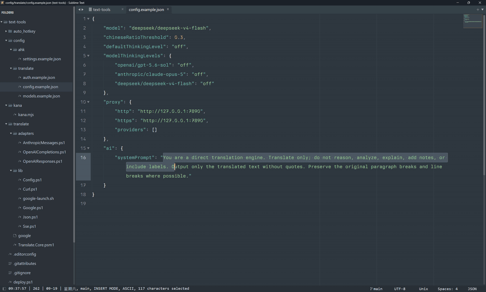
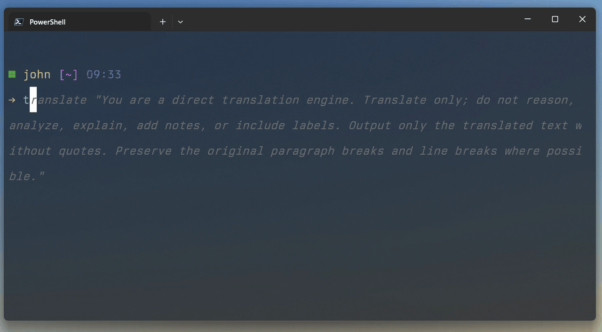

# text-tools

Select text anywhere in Windows, press a hotkey, and get a translation — or a
Japanese reading — in a popup that follows your system light/dark theme.

| Default hotkey | Action |
| --- | --- |
| <kbd>Win</kbd>+<kbd>Alt</kbd>+<kbd>A</kbd> | Translate the selection (one panel per configured engine) |
| <kbd>Win</kbd>+<kbd>Alt</kbd>+<kbd>S</kbd> | Annotate Japanese text with kana / furigana |

Both hotkeys can be changed or disabled in [`settings.json`](#settingsjson).

The translate popup also has a text box, so you can keep typing new phrases
without re-selecting anything. Results stream in as they arrive, each engine in
its own panel with a Copy button.



## Requirements

| Component | Needed for | Notes |
| --- | --- | --- |
| [AutoHotkey v2](https://www.autohotkey.com/) | everything | v2 only — v1 will not run this script |
| PowerShell | everything | Windows PowerShell 5.1 and PowerShell 7+ both work |
| [Node.js](https://nodejs.org/) | kana only | translation works fine without it |
| Git Bash with `gawk` + `cygpath` | the `google` engine only | ships with [Git for Windows](https://git-scm.com/download/win) |

## Install

```powershell
git clone <this-repo> text-tools
cd text-tools
.\deploy.ps1
```

That copies the program files to `~\.local\bin\text-tools`, puts small
`translate.ps1` and `kana.ps1` shims in `~\.local\bin` for the command line,
downloads the Japanese dictionary data, and writes starter configuration to
`~\.config\text-tools`. Then:

1. If you want AI translation, put your API keys in `~\.config\text-tools\auth.json`.
   Skip this if you only use the free `google` engine.
2. Run `~\.local\bin\text-tools\ahk\text.ahk`.
3. Select some text and press <kbd>Win</kbd>+<kbd>Alt</kbd>+<kbd>A</kbd> (the default).

To start it automatically, put a shortcut to `text.ahk` in your Startup folder
(<kbd>Win</kbd>+<kbd>R</kbd> → `shell:startup`).

### deploy.ps1

Re-run it any time; it only writes what actually changed.

| Option | Effect |
| --- | --- |
| `-TargetDir <path>` | Where the shims go (default `~\.local\bin`); the program goes in its `text-tools\` |
| `-Update` | `git pull --ff-only` first, then deploy |
| `-SkipVendor` | Don't download the Japanese dictionary data |
| `-Force` | Overwrite customised config (backs it up first) and re-download vendor files |
| `-WhatIf` | Show what would happen, write nothing |

How it decides what to do:

- **Program files** are compared by SHA-256 and copied only when they differ.
- **Vendor files** are skipped entirely when all 14 are present; otherwise only
  the missing ones are fetched. Nothing is downloaded on a normal re-run.
- **Configuration** is never silently overwritten. A file you have customised is
  kept and reported; `auth.json` is written once and then never touched again,
  because it holds your API keys.
- **Older configuration** in `~\.config\translate\` and `~\.config\ahk\settings.json`
  is migrated into any of the four files that does not exist yet. The old files
  are only read, never changed or deleted; keys with no place in the new layout
  are reported rather than carried over. Delete the old files yourself once
  everything works.

Updating later:

```powershell
.\deploy.ps1 -Update
```

## Configuration

All configuration lives in one directory, `%USERPROFILE%\.config\text-tools`
(written `~\.config\text-tools` below):

| File | Read by | Purpose |
| --- | --- | --- |
| `config.json` | the tools themselves | Each tool's options in its own section, plus the shared proxy |
| `settings.json` | the AutoHotkey front-end | Hotkeys, popup appearance, and which engines each popup runs |
| `models.json` | AI engines | Providers, their base URLs, API flavour, and models |
| `auth.json` | AI engines | API keys, one per provider. **Never commit this.** |

Set `TEXT_TOOLS_CONFIG_DIR` to use a different directory instead — useful for
testing without disturbing your real keys. The translator, the kana tool and
the AutoHotkey front-end all honour it, and so does `deploy.ps1`.

### `config.json`

```jsonc
{
  "proxy": {                     // shared by every tool that goes online
    "http": "http://127.0.0.1:7890",
    "https": "http://127.0.0.1:7890",
    "providers": ["google", "openai"]   // only these use the proxy
  },
  "llm": {                       // every AI engine
    "defaultThinkingLevel": "off",
    "modelThinkingLevels": { "openai/gpt-5.6-sol": "low" },
    "connectTimeoutSeconds": 10
  },
  "translate": {
    "model": "deepseek/deepseek-v4-flash",   // used when -Model is not given
    "chineseRatioThreshold": 0.3,
    "ai": { "systemPrompt": "...", "userPrompt": "..." }
  },
  "kana": { "to": "hiragana", "mode": "furigana" }
}
```

`proxy.providers` lists the providers (as named in `models.json`, or `google`)
that go through the proxy; the rest connect directly.

`llm.connectTimeoutSeconds` (a positive integer, default 10) limits only
connecting to the provider — the DNS lookup and the TCP and TLS handshakes. It
does not limit how long a response may take. Thinking levels are `off`, `low`,
`medium` or `high`; `modelThinkingLevels` overrides `defaultThinkingLevel` for
one `provider/model`.

`translate.chineseRatioThreshold` (0 to 1) is the share of Chinese characters
at which automatic detection translates into English instead of Chinese.

The two prompts sent to the model live under `translate.ai`:

- `systemPrompt` sets the rules the model follows for every request.
- `userPrompt` is the instruction for each request. `{language}` in it is
  replaced with `English` or `Simplified Chinese`. The selected text is always
  appended after it as a `<text>…</text>` block, so the instruction may refer
  to `<text>` but should not contain the block itself.

Both fall back to built-in defaults when missing or empty; a `userPrompt`
that is not a string is an error. The `google` engine uses neither.

`kana.to` picks the reading script — `hiragana`, `katakana`, or `romaji`.
`kana.mode` is `furigana` for the plain `日本語（にほんご）` form, or `ruby` for
HTML `<ruby>` markup. A missing or `null` value takes the default, hiragana
furigana; any other value is an error.

### `settings.json`

Read by the AutoHotkey front-end.

```jsonc
{
  "engines": {
    "translate": ["google", "openai/gpt-5.6-sol"]  // one panel per entry
  },
  "hotkeys": {
    "translate": "#!a",         // Win+Alt+A
    "kana": "#!s"               // null or "" disables it
  },
  "ui": {
    "theme": "auto",            // auto | light | dark
    "alwaysOnTop": false,
    "fontSize": 16,             // 1-72
    "fontName": "Microsoft YaHei UI",
    "width": 960,               // 200-10000
    "minHeight": 800,           // 150-10000
    "maxHeight": 1000,          // 150-10000
    "lineHeight": 1,            // 0.8-4, multiple of the natural line height
    "padding": 14               // 0-48, inner padding of the text boxes
  }
}
```

Each `engines.translate` entry is either `google` (free, no key) or
`provider/model`, where `provider` matches a key in `models.json`.

`hotkeys` values use AutoHotkey v2 [hotkey syntax](https://www.autohotkey.com/docs/v2/Hotkeys.htm):
`#` is Win, `!` Alt, `^` Ctrl and `+` Shift, so `#!a` is <kbd>Win</kbd>+<kbd>Alt</kbd>+<kbd>A</kbd>;
`!q` and `CapsLock & t` also work. Friendly forms like `Win+Alt+A` do not.
Set an action to `null` or `""` to disable it; a missing action keeps its
default. The hotkeys are read once at startup, so after editing them choose
**Reload Script** from the tray menu or run `text.ahk` again. A mistake is
reported in a popup at startup, and that action stays off rather than falling
back to its default; the other hotkey keeps working. Hotkeys are global and
take over the key combination from every other program.

### `models.json` and `auth.json`

```jsonc
// models.json: one entry per provider
{
  "openai": {
    "baseUrl": "https://api.openai.com/v1",
    "api": "openai-responses",
    "models": [{ "id": "gpt-5.6-sol" }]
  }
}

// auth.json: the key for each provider, under the same name
{ "openai": "sk-..." }
```

`api` must be one of `openai-completions`, `openai-responses`, or
`anthropic-messages`. An engine is named `provider/model`, for example
`openai/gpt-5.6-sol`.

## Command line

The translator and kana converter work on their own, which is the quickest way
to diagnose a problem without involving AutoHotkey:

```powershell
.\translate.ps1 -Text "Hello world"
.\translate.ps1 -Text "你好" -Mode google
.\translate.ps1 -Text "Hello" -Model openai/gpt-5.6-sol
"piped input works too" | .\translate.ps1
.\kana.ps1 -Text "日本語"
"日本語の文章" | .\kana.ps1
```

Both take input from `-Text`, `-InputFile`, the pipeline or stdin, write to
`-OutputFile` or stdout, and exit with 0 on success, 1 on failure, 2 for
invalid arguments and 130 when cancelled.



## Layout

`text.ahk` finds the other scripts by stripping `\ahk\<file>` from its
own path, so **this two-level structure is required**:

```
text-tools/
├── translate.ps1           <- must sit one level above ahk/
├── kana.ps1
├── ahk/
│   ├── text.ahk            <- entry point
│   ├── json.ahk, proc.ahk  <- #Include'd by text.ahk
│   ├── run-batch.ps1       <- runs all translate engines in one process
│   └── run-task.ps1        <- wraps the kana child process
├── common/                 <- JSON, child process and config helpers
├── llm/                    <- streams a prompt through a configured model
│   ├── Llm.Core.psm1
│   └── lib/, adapters/
├── translate/              <- translation engine
│   ├── Translate.Core.psm1
│   ├── lib/
│   └── google              <- third-party, see THIRD_PARTY.md
├── kana/                   <- kana annotation
│   ├── Kana.Core.psm1
│   ├── lib/
│   ├── kana.mjs            <- the converter, run under Node.js
│   └── vendor/             <- fetched by deploy.ps1, not in git
└── shims/                  <- deployed one level above text-tools/
    └── translate.ps1, kana.ps1
```

Moving `text.ahk` out of `ahk/` breaks it. The shims only forward to the
scripts of the same name in the `text-tools\` directory beside them.

## License

See `LICENSE`. Third-party components are listed in `THIRD_PARTY.md`.
